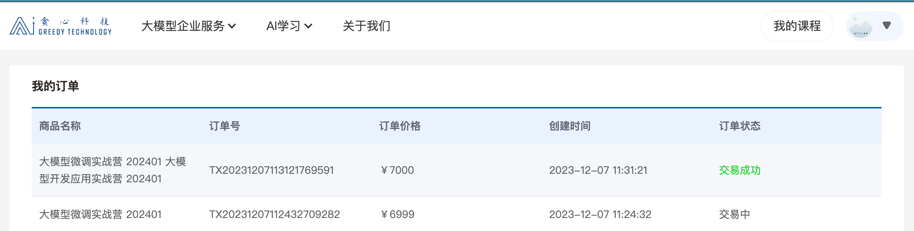
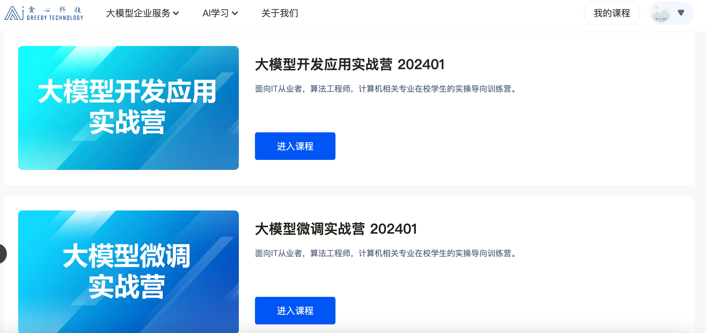

## gradio 

使用方式可以知乎搜索gradio关键字，参考我（[aplayboy](https://www.zhihu.com/people/aplayboy)）的知乎博客[一文搞懂模型展示工具Gradio的所有功能](https://zhuanlan.zhihu.com/p/679668818)。

## LLM

在过去工作经历中我确实缺少LLM模型的工作经验，但我这里是掌握和具备LLM的所有理论和部分实操的。

我这里有系统的学习了LLM的相关内容

课程链接如下:
* [大模型开发应用实战营](https://www.greedyai.com/ai-courses/LLM_developing)
* [大模型微调实战营-算法篇](https://www.greedyai.com/ai-courses/LLM_finetuning_algorithm)

